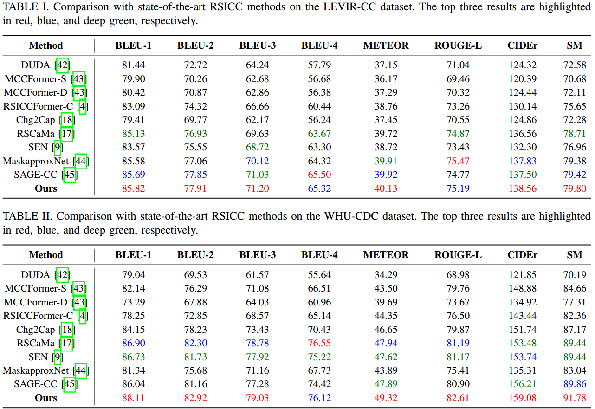
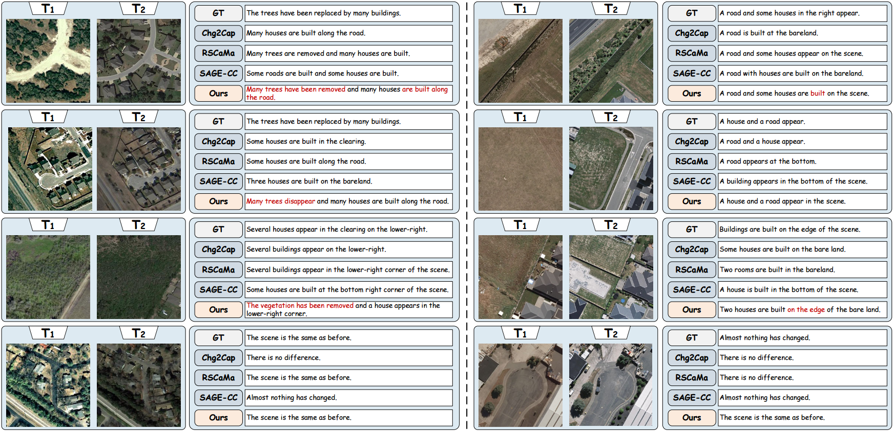

# ReScore: A Change Captioning Method for Remote Sensing via Feature Refinement and Score Matching

## Abstract

Remote sensing image change captioning (RSICC) aims to generate natural language descriptions for bi-temporal remote sensing images, enabling semantically interpretable understanding of scene changes. Existing methods, however, still struggle to capture both fine-grained structural variations and high-level semantic evolution, while lacking an explicit mechanism to identify caption-relevant change evidence from dense bi-temporal tokens. To address these issues, this article proposes ReScore, a change captioning method for remote sensing via feature refinement and score matching. Specifically, a frozen DINOv3 backbone is employed to extract four-scale features from bi-temporal images. A Detail--Semantic Feature Refinement (DSFR) module is designed to refine multi-scale representations by jointly preserving fine-grained structural details and high-level semantic context. Based on the refined features, a Change Score Matching (CSM) module compares corresponding bi-temporal tokens by jointly modeling their $\ell_2$ magnitude discrepancy and cosine directional discrepancy, thereby generating discriminative change scores for identifying caption-salient regions. Based on the matched score responses, salient change tokens are adaptively retained, while low-response tokens are aggregated into a compact background context representation. Finally, the selected tokens are fed into a Transformer decoder to generate accurate and semantically consistent change descriptions. Experiments on the LEVIR-CC and WHU-CDC datasets demonstrate that the proposed method consistently outperforms representative methods across multiple metrics.The code will be made publicly available at https://github.com/ZehuaChenLab/ReScore.

## Quantitative comparisons results on Levir-CC and WHU_CDC

## Qualitative comparison results on  Levir-CC and WHU_CDC

### The code will be released soon
